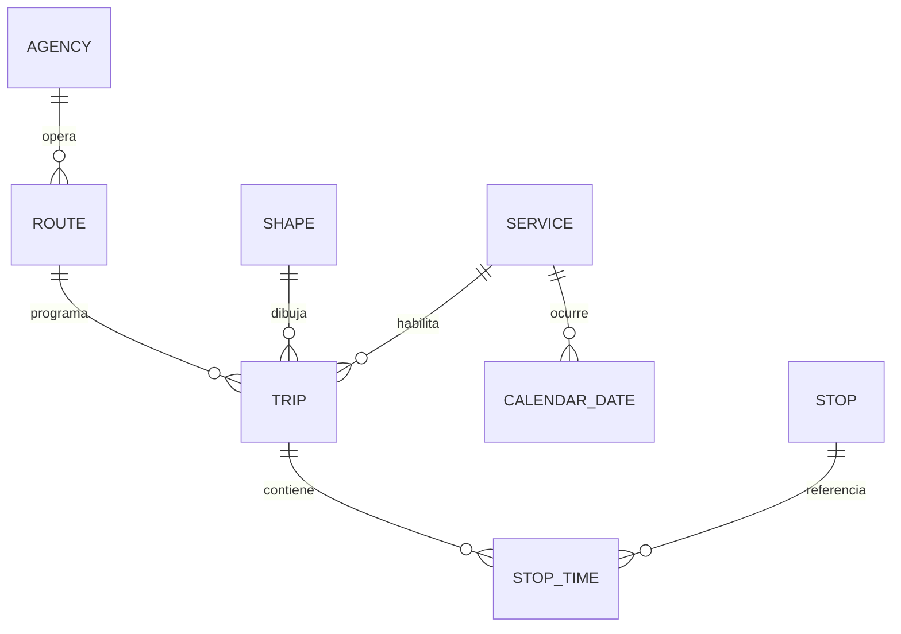
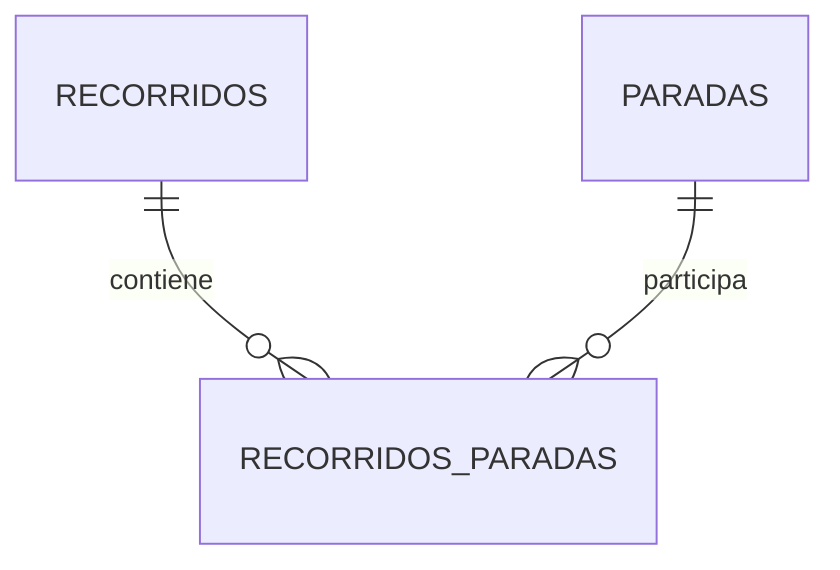
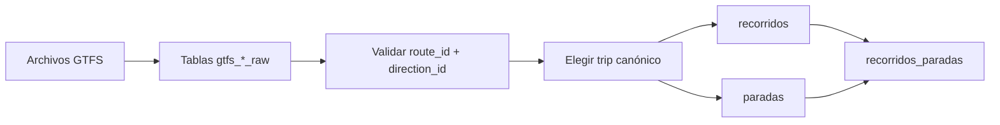

# Recorridos de colectivos: nombres y jerarquía

Este módulo importa un feed GTFS estático y lo transforma en el modelo de
recorridos utilizado por Vialis. El proceso conserva los identificadores GTFS
para poder rastrear cada dato hasta su archivo de origen.

## Jerarquía de GTFS

GTFS no relaciona una línea directamente con sus paradas. La relación atraviesa
los viajes programados y los horarios de parada:



La lectura de la jerarquía es:

1. Una `agency` es una empresa operadora.
2. Una `route` representa una línea o ramal publicado.
3. Un `trip` es una salida programada de esa ruta en una dirección determinada.
4. Un `stop_time` es la aparición ordenada de una parada dentro de un viaje.
5. Un `stop` representa una parada física, reutilizable por muchos viajes.
6. Un `shape` contiene los puntos que forman la geometría del recorrido.
7. Un `service_id` identifica los días en los que se ejecutan los viajes.

`SERVICE` es una entidad lógica en el diagrama: en este feed se materializa
mediante `service_id` y `calendar_dates.txt`, sin un archivo `calendar.txt`.

## Significado de los archivos y tablas raw

Las tablas de importación usan el prefijo `gtfs_` y el sufijo `_raw`. Sus
columnas mantienen los nombres originales de GTFS y todavía no contienen
geometrías PostGIS.

| Archivo | Tabla raw | Contenido principal |
|---|---|---|
| `agency.txt` | `vialis.gtfs_agency_raw` | Empresas operadoras |
| `routes.txt` | `vialis.gtfs_routes_raw` | Líneas y ramales publicados |
| `trips.txt` | `vialis.gtfs_trips_raw` | Viajes, dirección, destino y `shape_id` |
| `stops.txt` | `vialis.gtfs_stops_raw` | Paradas físicas y coordenadas |
| `stop_times.txt` | `vialis.gtfs_stop_times_raw` | Secuencia de paradas de cada viaje |
| `shapes.txt` | `vialis.gtfs_shapes_raw` | Puntos ordenados de cada geometría |
| `calendar_dates.txt` | `vialis.gtfs_calendar_dates_raw` | Fechas habilitadas por `service_id` |

Las tablas raw son `UNLOGGED` porque son staging descartable: el importador las
elimina y recrea antes de cada carga completa. Los identificadores se almacenan
como `TEXT`, aunque algunos parezcan números, porque GTFS los define como valores
opacos.

## Qué significa cada nombre GTFS

### `route_id`

Identifica de manera estable una fila de `routes.txt`. En este feed representa
un ramal publicado, pero no incluye la dirección. Se conserva en
`recorridos.gtfs_route_id`.

### `route_short_name`

Es el nombre visible para el usuario, por ejemplo `7A`, `505R3`, `AZUL1` u
`OE16V`. Se conserva completo en `recorridos.nombre_publico`.

La transformación también genera dos campos derivados:

- `linea`: prefijo numérico o alfabético inicial.
- `ramal`: sufijo restante; si no existe, se usa `TRONCAL`.

Ejemplos:

| `route_short_name` | `linea` | `ramal` |
|---|---|---|
| `7A` | `7` | `A` |
| `505R3` | `505` | `R3` |
| `AZUL1` | `AZUL` | `1` |
| `ROJA` | `ROJA` | `TRONCAL` |
| `OE16V` | `OE` | `16V` |

La separación es una convención de Vialis, no una regla definida por GTFS. Por
eso `nombre_publico` conserva siempre el valor original.

### `trip_id`

Identifica una salida programada. Diferentes `trip_id` pueden repetir exactamente
la misma geometría y secuencia de paradas, cambiando solamente sus horarios. No
se guarda como entidad final porque el objetivo de este módulo es obtener la
topología del recorrido, no cada servicio horario.

### `direction_id`

Distingue las dos direcciones de una ruta. Vialis conserva directamente `0` y
`1`; no los traduce a IDA/VUELTA porque GTFS no asigna ese significado.

### `trip_headsign`

Describe el destino anunciado del viaje, por ejemplo `a Retiro`. Se guarda en
`recorridos.destino` y ayuda a interpretar cada `direction_id`.

### `shape_id`

Identifica la geometría utilizada por un viaje. Los puntos de `shapes.txt` se
ordenan por `shape_pt_sequence` para construir un `LineString`. El valor original
se conserva en `recorridos.gtfs_shape_id`.

### `stop_id` y `stop_sequence`

`stop_id` identifica una parada física. `stop_sequence` indica su posición
dentro de un viaje y solo tiene sentido junto con un `trip_id`.

Por ese motivo, `stop_id` se transforma en una fila de `paradas`, mientras que
`stop_sequence` se guarda como `recorridos_paradas.nro_parada`.

## Jerarquía del modelo Vialis



### `vialis.recorridos`

Representa un ramal en una dirección. Su identidad lógica es:

```text
gtfs_route_id + direction_id
```

Para este feed, cada combinación tiene exactamente un `shape_id`. La
transformación valida esa condición y se detiene si un feed futuro contiene más
de una geometría para la misma combinación.

Como existen muchos viajes programados por recorrido, se elige un viaje
canónico con estas prioridades:

1. Mayor cantidad de paradas.
2. Mayor duración programada.
3. Menor `trip_id` en orden textual, como desempate determinista.

`tiempo_total_minutos` no se toma solamente del viaje canónico: se calcula como
la mediana de las duraciones de todos los viajes del mismo
`route_id + direction_id`.

### `vialis.paradas`

Representa una parada física única. Una parada puede aparecer en muchos
recorridos, por lo que no contiene una clave foránea directa a `recorridos`.

| Columna | Significado |
|---|---|
| `id_parada` | Identificador interno de Vialis |
| `gtfs_stop_id` | Identificador original de GTFS |
| `codigo` | Código público de la parada, si existe |
| `nombre` | Nombre procedente de `stops.txt` |
| `posicion` | Punto PostGIS con SRID 4326 |

### `vialis.recorridos_paradas`

Es la relación ordenada entre recorridos y paradas. Permite reutilizar una misma
parada física sin duplicar su nombre ni sus coordenadas.

| Columna | Significado |
|---|---|
| `id_recorrido` | Recorrido al que pertenece la aparición |
| `id_parada` | Parada física referenciada |
| `nro_parada` | Orden procedente de `stop_sequence` |
| `tramo_hasta_siguiente` | Porción del `shape` hasta la próxima parada |
| `distancia_hasta_siguiente_metros` | Longitud geográfica de ese tramo |

La última parada de cada recorrido tiene el tramo y la distancia en `NULL`, ya
que no existe una parada siguiente.

## Flujo de transformación



Los scripts se ejecutan en este orden:

1. `crear_gtfs_raw.sql`: recrea las tablas staging.
2. `importar_gtfs_raw.ps1`: ejecuta el DDL raw e importa los siete CSV mediante
   `psql \copy`.
3. `transformar_gtfs.sql`: crea índices, valida el feed y reemplaza los datos de
   las tablas finales.

El importador ejecuta automáticamente el primer paso. La transformación se
ejecuta por separado para permitir inspeccionar las tablas raw antes de reemplazar
el modelo final.

## Datos que no provienen de GTFS

Los campos `caudal_pasajeros` e `ingreso_economico` permanecen en `NULL`. GTFS
describe oferta de transporte, horarios y topología, pero no contiene pasajeros
transportados ni recaudación. Esos valores deben incorporarse desde otra fuente.
