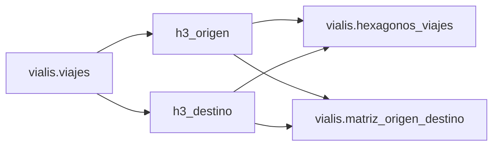
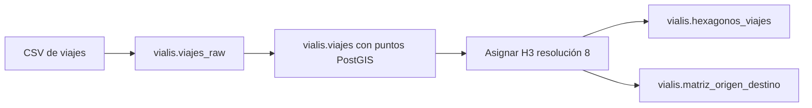

# Viajes y hexágonos H3

Este módulo importa viajes de transporte público y genera una representación
espacial agregada mediante celdas H3. La carga utilizada por Vialis representa
un día hábil típico de viajes con foco en CABA: no es un registro en tiempo real
ni una serie histórica de viajes ocurridos en una fecha calendario concreta.

Los campos de origen siguen el conjunto de datos
[Viajes y etapas en transporte público del Área Metropolitana de Buenos Aires](https://data.buenosaires.gob.ar/dataset/viajes-etapas-transporte-publico),
elaborado a partir de SUBE. La fuente oficial tiene alcance AMBA; los scripts de
este módulo no aplican por sí mismos un recorte al límite de CABA, por lo que el
alcance geográfico efectivo depende del CSV cargado en `viajes_raw`.

## Viajes y etapas

Un viaje representa el desplazamiento completo inferido para una tarjeta SUBE.
Puede estar compuesto por una o más etapas, por ejemplo un colectivo seguido de
un subte. La tabla `viajes` conserva el origen y el destino del desplazamiento,
la cantidad de etapas de cada modo y atributos agregados de la persona asociada
a la tarjeta.


Una fila no equivale necesariamente a un solo viaje observado en la población.
Para producir estimaciones se debe utilizar `factor_expansion_viaje`: contar
filas describe la muestra, mientras que sumar el factor estima la cantidad de
viajes representados.

## Modelo espacial



Los índices `h3_origen` y `h3_destino` se calculan con resolución H3 8. En
`viajes` funcionan como referencias lógicas: el DDL actual no declara claves
foráneas desde esa tabla hacia `hexagonos_viajes`.

## `vialis.viajes`

Contiene una fila por viaje inferido en la carga del día típico. Las coordenadas
de origen y destino del CSV se convierten a puntos PostGIS y luego se indexan en
H3.

La tabla no posee actualmente una clave primaria. El par `id_tarjeta` e
`id_viaje` conserva los identificadores de la fuente y permite relacionar el
viaje con sus etapas cuando se dispone de la tabla de etapas.

| Columna | Significado |
|---|---|
| `id_tarjeta` | Identificador enmascarado de la tarjeta SUBE |
| `id_viaje` | Identificador del viaje asociado a la tarjeta |
| `cantidad_etapas` | Cantidad de etapas válidas y completas que forman el viaje |
| `rango_horario` | Hora o franja horaria asignada al viaje por la fuente |
| `etapas_subte` | Cantidad de etapas realizadas en subte |
| `etapas_tren` | Cantidad de etapas realizadas en tren |
| `etapas_colectivo` | Cantidad de etapas realizadas en colectivo |
| `geom_origen` | Punto de origen agregado, como `GEOMETRY(Point, 4326)` |
| `geom_destino` | Punto de destino agregado, como `GEOMETRY(Point, 4326)` |
| `h3_origen` | Índice de la celda H3 de resolución 8 que contiene el origen |
| `h3_destino` | Índice de la celda H3 de resolución 8 que contiene el destino |
| `departamento_origen_viaje` | Código censal del departamento de origen |
| `departamento_destino_viaje` | Código censal del departamento de destino |
| `factor_expansion_viaje` | Peso utilizado para expandir el registro de la muestra a una estimación de viajes |
| `etapas_incompletas` | Indicador de que alguna etapa no tiene un destino imputado |
| `genero` | Género registrado para la persona asociada a la tarjeta SUBE |
| `grupo_edad` | Grupo de edad de cinco años registrado para esa persona |

### Identificadores

`id_tarjeta` está enmascarado en la fuente. No identifica públicamente a una
persona ni debe interpretarse como el número físico de una tarjeta. `id_viaje`
se conserva junto con él para mantener la trazabilidad con las etapas.

### Geometrías

`geom_origen` y `geom_destino` se construyen con longitud como coordenada X y
latitud como coordenada Y, usando SRID 4326. Son ubicaciones agregadas por la
fuente y no deben interpretarse como domicilios o posiciones GPS exactas.

Los índices GiST `idx_viajes_geom_origen` e `idx_viajes_geom_destino` aceleran
filtros espaciales sobre ambos extremos del viaje.

### Factor de expansión

Para estimar viajes se suma el factor, no la cantidad de filas:

```sql
SELECT SUM(factor_expansion_viaje) AS viajes_estimados
FROM vialis.viajes;
```

La cantidad de registros y la estimación expandida responden preguntas
distintas. Si el factor es `NULL`, la fila no aporta peso a la construcción de
`hexagonos_viajes`, porque ese proceso lo reemplaza por cero.

### Datos incompletos y atributos demográficos

`etapas_incompletas` permite decidir si un viaje cuyo destino no pudo imputarse
por completo debe participar de un análisis. El esquema no define un catálogo
de valores para este indicador, `genero` ni `grupo_edad`; cualquier
interpretación de sus códigos debe validarse contra el archivo fuente cargado.

## `vialis.hexagonos_viajes`

Contiene una fila por celda H3 de resolución 8 observada como origen o destino.
No almacena el polígono de la celda: este puede derivarse cuando se consulta a
partir de `indice_h3`.

| Columna | Significado |
|---|---|
| `indice_h3` | Identificador H3 de resolución 8 y clave primaria de la tabla |
| `punto_maxima_concurrencia` | Punto de origen o destino con mayor peso acumulado dentro de la celda |
| `concurrencia` | Suma de factores de expansión correspondiente únicamente al punto seleccionado |

### Cálculo del punto de máxima concurrencia

`hexagonos_viajes.sql` calcula cada fila de esta manera:

1. Une todos los orígenes y destinos en un único conjunto de eventos.
2. Asigna a cada evento el `factor_expansion_viaje` como peso; un factor `NULL`
   aporta cero.
3. Agrupa eventos de una misma celda que tengan exactamente la misma geometría.
4. Suma sus factores de expansión.
5. Selecciona el punto de mayor suma dentro de cada celda.
6. En caso de empate, prioriza el punto con más registros y luego aplica un
   desempate determinista por latitud y longitud.

Orígenes y destinos se consideran eventos independientes. Un viaje cuyo origen
y destino estén en la misma celda aporta dos eventos al cálculo.

Aunque el campo se denomina `concurrencia`, no representa personas presentes al
mismo tiempo: el cálculo actual no agrupa por `rango_horario`. Tampoco representa
la demanda total de la celda; representa solamente el peso acumulado en el punto
más concurrido de ella.

El script usa `ON CONFLICT` para insertar celdas nuevas y actualizar las ya
existentes. No elimina automáticamente celdas que hayan desaparecido de una
carga posterior.

### Visualización del hexágono

Para mostrar las celdas en el visor de geometrías de pgAdmin se deriva un
polígono PostGIS con SRID 4326:

```sql
SELECT
    indice_h3,
    punto_maxima_concurrencia,
    concurrencia,
    h3_cell_to_boundary_geometry(indice_h3::h3index) AS geom
FROM vialis.hexagonos_viajes;
```

El cast directo `indice_h3::h3index::geometry` representa el centro de la celda,
no su contorno. Para visualizar el área se debe usar
`h3_cell_to_boundary_geometry`.

## Flujo de carga



Los scripts se utilizan en este orden:

1. `ddl.sql` crea las tablas finales.
2. `importar_viajes.sql` crea `viajes_raw`, transforma las coordenadas en puntos,
   crea los índices espaciales y asigna las celdas H3.
3. `hexagonos_viajes.sql` calcula el punto de mayor peso de cada celda.
4. `matriz_origen_destino.sql` agrega los factores por par de celdas de origen y
   destino.

La importación efectiva del CSV en `viajes_raw` es un paso externo indicado,
pero no implementado, dentro de `importar_viajes.sql`.
